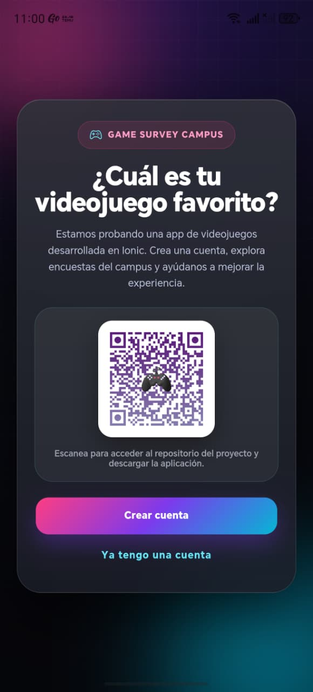
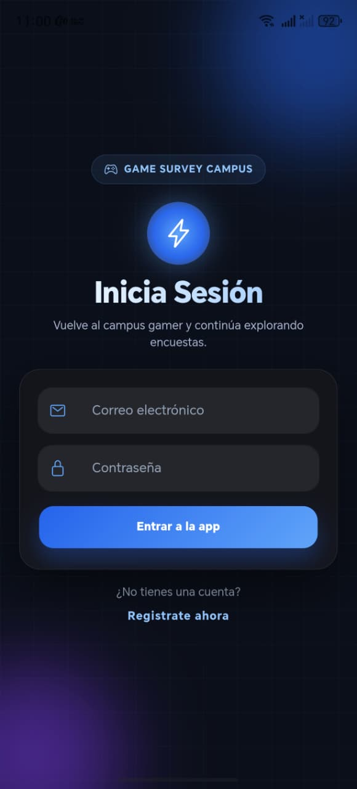
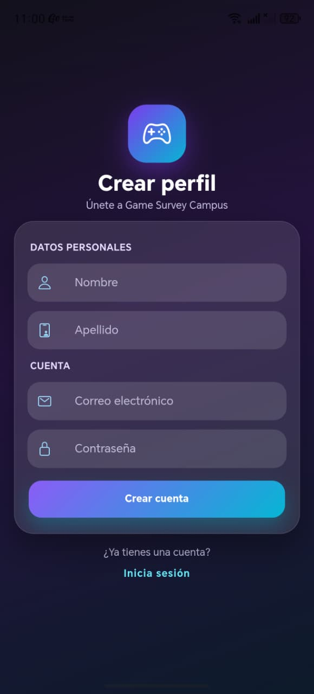
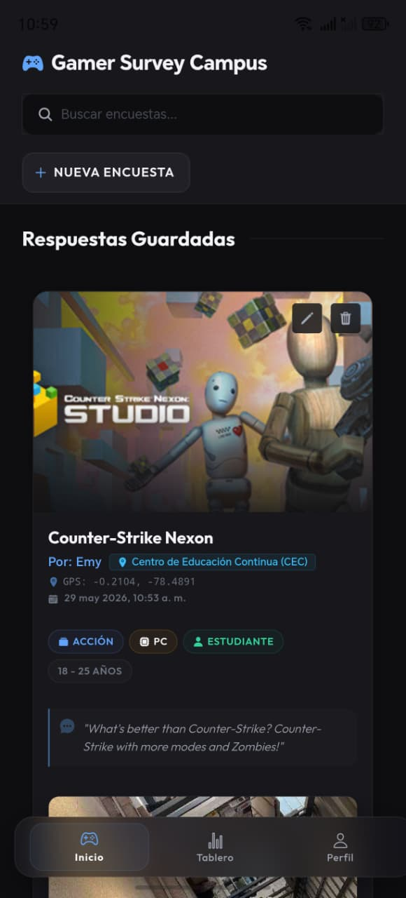
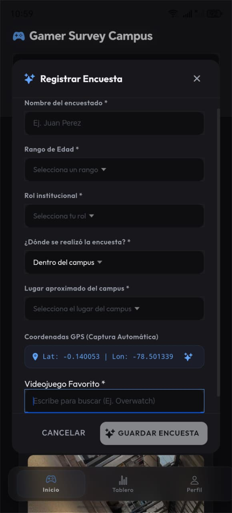
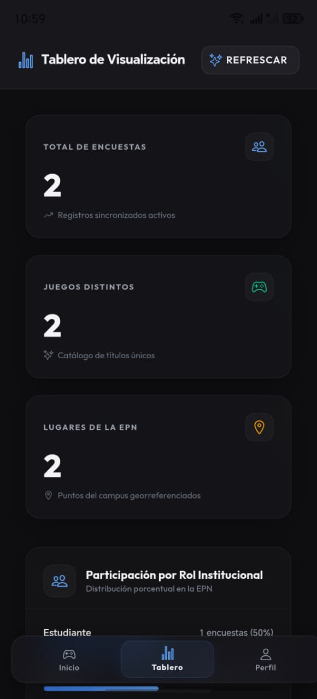
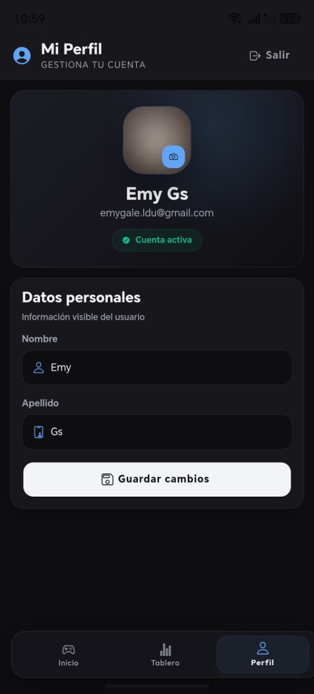
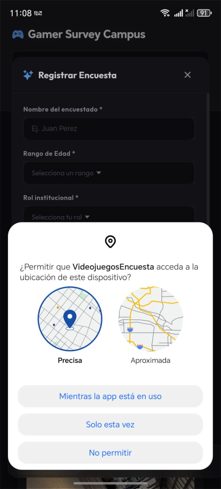

# 🎮 Game Survey Campus

## 👩‍💻👨‍💻 Estudiantes

**Emily Alejandra Galeas Tingo**
**Joel Eduardo Torres Mora**

---

# 📌 Descripción del Proyecto

Game Survey Campus es una aplicación móvil desarrollada con **Ionic + Angular** y **Firebase**, creada para el examen del primer bimestre de la materia de Aplicaciones Móviles.

La aplicación permite recopilar información sobre las preferencias de videojuegos de los estudiantes de la Escuela Politécnica Nacional mediante encuestas realizadas dentro del campus.

Además, incorpora autenticación de usuarios, gestión de perfiles, almacenamiento en la nube, geolocalización y visualización de resultados.

---

# 🛠️ Tecnologías Utilizadas

## Frontend

* Ionic Framework
* Angular
* TypeScript
* HTML
* SCSS

## Backend y Base de Datos

* Firebase Authentication
* Cloud Firestore

## Consumo de API

* FreeToGame API

## Herramientas

* Capacitor
* Android Studio
* Visual Studio Code

---

# 📱 Funcionalidades Implementadas

## 🔐 Autenticación de Usuarios

La aplicación permite:

* Registro de usuarios
* Inicio de sesión
* Cierre de sesión
* Validación de credenciales
* Persistencia de sesión

---

## 👤 Gestión de Perfil

Cada usuario puede:

* Visualizar su información
* Editar nombre y apellido
* Actualizar fotografía de perfil
* Mantener sus datos almacenados en Firebase

---

## 🎮 Encuestas de Videojuegos

La aplicación permite:

* Registrar encuestas relacionadas con videojuegos
* Buscar videojuegos mediante una API externa
* Seleccionar videojuegos para responder la encuesta
* Almacenar respuestas en la nube

---

## 🌐 Consumo de API

Se utilizó la API pública:

https://www.freetogame.com/api-doc

Permitiendo:

* Obtener videojuegos disponibles
* Buscar videojuegos por nombre
* Mostrar información relevante para las encuestas

---

## 📍 Geolocalización

Durante cada encuesta se registra:

* Latitud
* Longitud
* Ubicación del encuestado dentro del campus

La información se almacena junto con los resultados de la encuesta.

---

## 📊 Dashboard de Visualización

La aplicación incorpora un tablero donde se pueden visualizar:

* Total de encuestas realizadas
* Videojuegos registrados
* Información recopilada durante el trabajo de campo
* Estadísticas generales del proyecto

---

## 📱 Pantalla de Bienvenida

La aplicación cuenta con:

* Pantalla de presentación
* Información del proyecto
* Código QR
* Acceso directo a registro e inicio de sesión

---

# 🎨 Diseño de la Aplicación

La interfaz fue diseñada utilizando:

* Glassmorphism
* Gradientes modernos
* Diseño responsive
* Componentes visuales inspirados en videojuegos
* Tarjetas dinámicas
* Animaciones suaves

El objetivo fue ofrecer una experiencia moderna y atractiva para los estudiantes.

---

# ☁️ Firebase

## Firebase Authentication

Utilizado para:

* Registro de usuarios
* Inicio de sesión
* Gestión de sesiones

## Cloud Firestore

Utilizado para almacenar:

* Información de usuarios
* Encuestas
* Ubicaciones
* Datos estadísticos

---

# 🚀 Instalación del Proyecto

## 1. Clonar repositorio

```bash
git clone URL_DEL_REPOSITORIO
```

---

## 2. Instalar dependencias

```bash
npm install
```

---

## 3. Ejecutar proyecto

```bash
ionic serve
```

---

## 4. Ejecutar en Android

```bash
ionic build
npx cap sync android
npx cap open android
```

---

# 📦 Dependencias Principales

```bash
npm install firebase
npm install @capacitor/android
npm install @capacitor/camera
npm i
```

---

# 📷 Evidencias

| 🚀 Welcome                     | 🔐 Login                     | 👤 Registro                     | 🎮 Home                     |
| ------------------------------ | ---------------------------- | ------------------------------- | --------------------------- |
|  |  |  |  |

| 📝 Encuesta                     | 📊 Dashboard                     | 👤 Perfil                     | 📍 Geolocalización                     |
| ------------------------------- | -------------------------------- | ----------------------------- | -------------------------------------- |
|  |  |  |  |

---
# 🌐 Accesos del Proyecto

## 📱 Descarga del APK

La versión Android de la aplicación en el siguiente link:

🔗 [Descargar APK](https://epnecuador-my.sharepoint.com/:u:/g/personal/emily_galeas_epn_edu_ec/IQAHz11xkfxvTKQfyuLRgzYDAbQMe8GXg0ukA0gbit6bYRM?e=3ittiR)

---

## ☁️ Sitio Web Desplegado

La aplicación también se encuentra desplegada mediante Firebase Hosting:

🔗 [Despliegue](https://tu-proyecto.web.app)

---

## 🎥 Video de Funcionamiento

🔗 

---

# 📚 Aprendizajes Obtenidos

Durante el desarrollo del proyecto se reforzaron conocimientos relacionados con:

* Ionic Framework
* Angular
* Firebase Authentication
* Cloud Firestore
* Consumo de APIs REST
* Geolocalización
* Manejo de formularios
* Gestión de perfiles
* Desarrollo móvil multiplataforma
* Diseño UI/UX
* Compilación para Android

---

# ✅ Conclusión

Game Survey Campus permitió integrar diferentes tecnologías utilizadas durante la materia de Aplicaciones Móviles en una única solución funcional.

A través del uso de Ionic, Firebase y APIs externas se desarrolló una aplicación capaz de recopilar información de estudiantes, gestionar usuarios y visualizar resultados, demostrando la aplicación práctica de los conocimientos adquiridos durante el primer bimestre.
